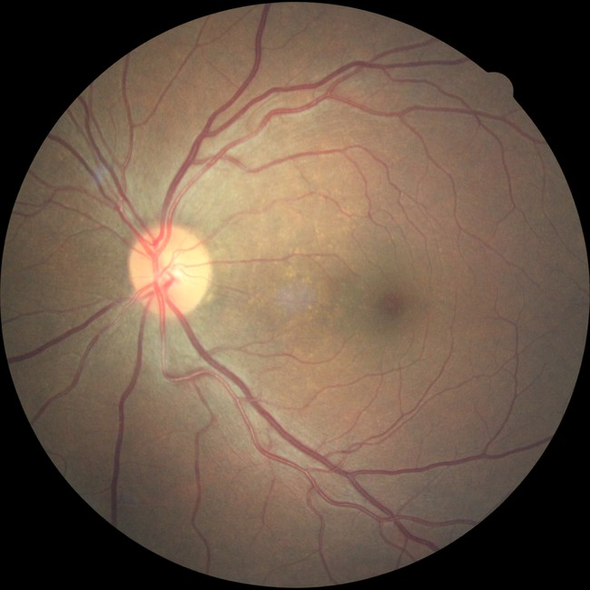

# Diabetic Retinopathy

The Dataset contains images of the left and right retinas of the subjects. Corresponding labels give the level of  "diabetic retinopathy." Diabetic retinopathy is one of the leading causes of blindness in working populations. The following repo contains various experiments with different architectures and techniques to improve classification accuracy. Quadratic Cohens Kappa is used to evaluate the performance of various models & experiments.

The following are the files and corresponding experiments.

**EfNetB3 V1**

The baseline model uses a 120x120 pixels image as input. *Cross entropy* is the loss function used. The left retina image and right retina image are treated as separate entities for this model.

| Training Accuracy | 86.94 |
| --- | --- |
| Training Kappa | 0.8132 |
| Validation Accuracy | 75.20 |
| Validation Kappa | 0.542 |

**EfNetB3 V2**

As an improvement over the previous version, the images are preprocessed. As the images in the Dataset are from different cameras, under different lighting, it is essential to standardise them. Standardisation is achieved by removing the background and maintaining the exact proportions and aspect ratios across the images. The performance of V2 is slightly improved over the model V1.

| Training Accuracy | 88.92 |
| --- | --- |
| Training Kappa | 0.8432 |
| Validation Accuracy | 77.20 |
| Validation Kappa | 0.642 |

**EfNetB3 V3**

Quadratic Cohens Cappa value increases quadratically as the distance between actual and predicted labels increase. In contrast, the cross-entropy loss function does not have this behaviour. Cross Entropy Loss is a good loss function for many cases. For this specific case, it is not optimal to use it.

Quadratic loss does not exactly work correctly on classification labels. For this reason, this is treated as a regression problem where the output of the final layer is a real number. These numerical predictions are converted into integer predictions & class labels for validation. A quadratic loss is used to better correlate loss function and performance evaluation metrics. By doing this, V3 has performed significantly better than V2.

| Training Accuracy | 92.04 |
| --- | --- |
| Training Kappa | 0.84913 |
| Validation Accuracy | 80.34 |
| Validation Kappa | 0.662 |

**EfNetB3 V4**

Various augmentation techniques are tried and evaluated for better generalisation of the model and to boost the performance of the model. Augmentation techniques did not give the performance expected. It did not make better the performance of the model over V3.

| Training Accuracy | 88.04 |
| --- | --- |
| Training Kappa | 0.81913 |
| Validation Accuracy | 75.86 |
| Validation Kappa | 0.581 |

**EfNetB3 V5**

Left and right retina images are treated as separate entities until this stage. Now, the idea is to use information from left and right images of the subject to predict the stage of diabetic retinopathy in the subject. Model V4 (without the final output layer) is run on the left and right images. The features extracted from both the images are augmented and fed into a shallow neural network built on top of it. This significantly boosted the performance of the model.

| Training Accuracy | 93.12 |
| --- | --- |
| Training Kappa | 0.841 |
| Validation Accuracy | 81.42 |
| Validation Kappa | 0.681 |
